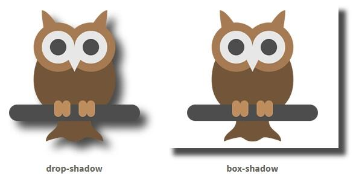

# drop-shadow() (filter)

### O que é?

Função CSS.

### Para que serve?

Aplica um efeito de sombra projetada à imagem de entrada. Diferente do `box-shadow` ele nos permite adicionar uma sombra a um elemento que não corresponde à sua caixa delimitadora. Ou seja, ele é capaz de perceber o formato da imagem que está sendo renderizada para aplicar a sombra, e isso também é válido se ao invés de uma imagem com fundo transparente, tivermos um SVG.

### Exemplo



Código:

```css
.drop-shadow {
  -webkit-filter: drop-shadow(12px 12px 7px rgba(0, 0, 0, 0.7));
  filter: drop-shadow(12px 12px 7px rgba(0, 0, 0, 0.7))
}

.box-shadow {
  box-shadow: 12px 12px 7px rgba(0, 0, 0, 0.7);
}
```

### Suporte aos navegadores

- [Can I Use](https://caniuse.com/css-boxshadow)

### Referências

- [MDN](https://developer.mozilla.org/en-US/docs/Web/CSS/filter-function/drop-shadow())
